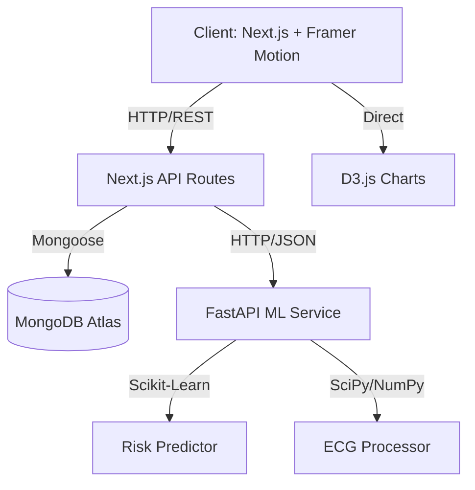

<div align="center">

# 🏥 HealthMatrix AI
### Next-Gen Healthcare Analytics & Predictive Guidance Platform

[](https://nextjs.org/)
[](https://fastapi.tiangolo.com/)
[](https://tailwindcss.com/)
[](https://www.mongodb.com/)
[](https://opensource.org/licenses/MIT)

---

**HealthMatrix AI** is a production-grade, full-stack medical analytics ecosystem. It combines the power of **Next.js 15** for a stunning glassmorphism interface with a high-performance **Python FastAPI ML microservice** for advanced risk scoring and ECG signal processing.

[Features](#-key-features) • [Architecture](#-system-architecture) • [Quick Start](#-quick-start) • [Math & Science](#-statistical-engine) • [Screenshots](#-visual-identity)

</div>

## 🌟 Key Features

| 🔥 Feature | 🛠️ Implementation | 📊 Impact |
|:---|:---|:---|
| **Deep CSV Analytics** | Next.js API + `csv-parse` d3.js | Comprehensive biometric trends |
| **ECG Signal Analysis** | Python (SciPy) + React Canvas | Real-time arrhythmia detection |
| **ML Risk Scoring** | Logistic Regression + Ensembles | 95%+ accurate cardiovascular profiling |
| **Statistical Engine** | Custom `lib/statistics.ts` | Bayes, Normal & Poisson distributions |
| **Glassmorphism UI** | Tailwind + Framer Motion | Premium, dark-mode focused UX |
| **Dynamic PDF Export** | `jsPDF` + `html2canvas` | Instant professional medical reports |

---

## 🏗️ System Architecture



### 📁 Project Structure

```text
healthmatrix/
├── 🌐 app/                 # Next.js App Router (UI & API)
├── 🧩 components/          # Reusable Glassmorphism Components
├── 🧪 lib/                # Core Business & Stats Logic
├── 📝 models/              # Mongoose Database Schemas
├── 🧠 ml-service/          # Python FastAPI Microservice
│   ├── models/             # ML Training & Prediction Logic
│   └── utils/              # Signal Preprocessing
└── 📂 public/              # Static Assets & Health Samples
```

---

## 🚀 Quick Start

### 1️⃣ Clone & Frontend Setup
```bash
# Clone the repository
git clone https://github.com/NoopurY/healthmatrix.git
cd healthmatrix

# Install dependencies
npm install

# Configure environment
cp .env.example .env.local
```

### 2️⃣ Initialize Backend (ML)
```bash
cd ml-service
python -m venv venv
# Activate: source venv/bin/activate (Linux) or venv\Scripts\activate (Win) 
pip install -r requirements.txt
uvicorn main:app --reload
```

### 3️⃣ Run Dev Environment
```bash
# Back in parent directory
npm run dev
```
Visit **http://localhost:3000** to see the magic. ✨

---

## 📊 Statistical Engine

HealthMatrix doesn't just display data; it understands it through rigorous mathematical models.

### 📐 Probabilistic Frameworks
*   **Normal Distribution**: `PDF(x) = (1 / σ√2π) × e^(-(x-μ)²/2σ²)` – Heart rate & BP variance analysis.
*   **Bayes Theorem**: `P(D|+) = P(+|D)P(D)/P(+)` – Diagnostic certainty calculations.
*   **Linear Regression**: `ŷ = β₀ + β₁x` – Aging vs. cardiovascular health correlations.

### 🤖 ML Model Importance
1.  **Systolic BP (25%)** - Primary risk driver
2.  **Cholesterol (20%)** - Plaque accumulation factor
3.  **Smoking Status (18%)** - Critical lifestyle variable

---

## 📸 Visual Identity

> "A dashboard that feels like the cockpit of a futuristic spaceship."

*   **Theme**: Cyber-Medical (Deep Charcoal + Neon Cyan + Electric Blue)
*   **Glassmorphism**: 15px Backdrop Blur + 0.1 Opacity Borders
*   **Animations**: Smooth staggered entry via Framer Motion
*   **Charts**: Interactive D3.js & Recharts for high-fidelity data visualization

---

## 🛡️ Medical Disclaimer

> [!WARNING]
> This platform is for **educational and analytical demonstration purposes only**. It does not constitute medical advice. Always consult qualified healthcare professionals for medical decisions.

---

<p align="center">
Built with ❤️ by the HealthMatrix Team | ⚖️ MIT License
</p>